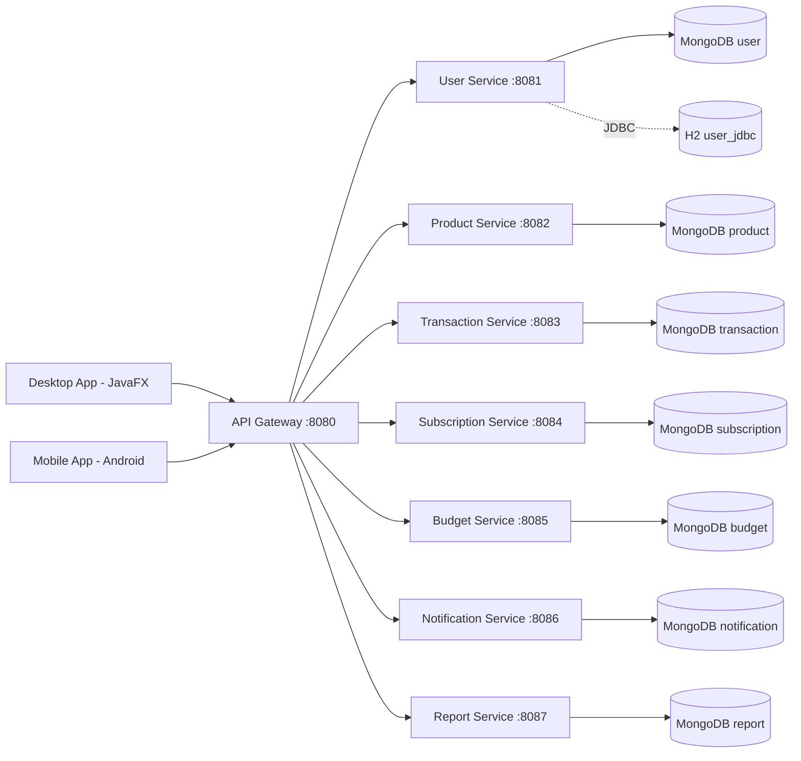

# CepteFinans - Kisisel Finans ve Abonelik Takip Sistemi

Bu repo, Java 17+ tabanli mikroservis mimarisinde gelistirilen FinTrack uygulamasinin kod tabanidir.

## Moduller

- `backend/common-lib`: Generic yapilar, ortak exception/model siniflari
- `backend/api-gateway`: Spring Cloud Gateway (port 8080)
- `backend/service-user`: Kullanici mikroservisi (port 8081) - JWT login + JDBC/MongoDB dual repo
- `backend/service-product`: Urun mikroservisi (port 8082)
- `backend/transaction-service`: Gelir/gider islem mikroservisi (port 8083)
- `backend/subscription-service`: Abonelik mikroservisi (port 8084)
- `backend/budget-service`: Butce mikroservisi (port 8085)
- `backend/notification-service`: Bildirim mikroservisi (port 8086)
- `backend/report-service`: Rapor mikroservisi (port 8087)
- `desktop-app`: JavaFX masaustu istemcisi (Dark Theme + Custom Charts)
- `mobile-app`: Android (Java) istemci iskeleti
- `k6`: Performans testleri
- `docs`: Mimari ve performans dokumanlari

## Teknolojiler

- Java 17
- Spring Boot 3 / Spring Data MongoDB / Spring Data JPA
- Spring Cloud Gateway
- H2 Database (JDBC test profili)
- OpenAPI/Swagger (springdoc)
- JUnit 5 + Mockito + Testcontainers
- Docker + Docker Compose
- JavaFX + Custom Canvas Graphics
- Android (Java + Retrofit)
- k6 Load Testing

## Hizli Baslangic

### Docker ile Tum Sistemi Calistir

```bash
docker compose up --build
```

Servisler ayaga kalktiginda:
- Gateway: http://localhost:8080
- User Service: http://localhost:8081
- Product Service: http://localhost:8082
- Transaction Service: http://localhost:8083
- Subscription Service: http://localhost:8084
- Budget Service: http://localhost:8085
- Notification Service: http://localhost:8086
- Report Service: http://localhost:8087

### Swagger Arayuzleri
- User: http://localhost:8081/swagger-ui/index.html
- Product: http://localhost:8082/swagger-ui/index.html

### JavaFX Desktop Uygulamasi

```bash
cd desktop-app
mvn javafx:run
```

### Android Mobil Uygulama
Android Studio ile `mobile-app` klasorunu acin ve calistirin.

## API Endpoint Ozeti

### User Service (`/api/users`)
- `POST /api/users` - Kullanici olustur
- `GET /api/users` - Tum kullanicilar
- `GET /api/users/{id}` - Kullanici detayi
- `DELETE /api/users/{id}` - Kullanici sil
- `POST /api/auth/login` - JWT token al

### Product Service (`/api/products`)
- `POST /api/products` - Urun olustur
- `GET /api/products` - Tum urunler
- `GET /api/products/{id}` - Urun detayi
- `DELETE /api/products/{id}` - Urun sil

### Transaction Service (`/api/transactions`)
- `POST /api/transactions` - Islem olustur
- `GET /api/transactions` - Tum islemler (filtre: userId, type)
- `GET /api/transactions/{id}` - Islem detayi
- `DELETE /api/transactions/{id}` - Islem sil

### Subscription Service (`/api/subscriptions`)
- `POST /api/subscriptions` - Abonelik olustur
- `GET /api/subscriptions` - Tum abonelikler (filtre: userId, active)
- `GET /api/subscriptions/upcoming` - Yaklasan odemeler
- `DELETE /api/subscriptions/{id}` - Abonelik sil

### Budget Service (`/api/budgets`)
- `POST /api/budgets` - Butce olustur
- `GET /api/budgets` - Tum butceler
- `GET /api/budgets/user/{userId}` - Kullanici butceleri
- `GET /api/budgets/user/{userId}/status` - Aylik butce durumu
- `DELETE /api/budgets/{id}` - Butce sil

### Notification Service (`/api/notifications`)
- `POST /api/notifications` - Bildirim olustur
- `GET /api/notifications` - Tum bildirimler
- `GET /api/notifications/user/{userId}/unread` - Okunmamis bildirimler
- `PATCH /api/notifications/{id}/read` - Bildirimi okundu isaretle
- `DELETE /api/notifications/{id}` - Bildirim sil

### Report Service (`/api/reports`)
- `POST /api/reports` - Rapor olustur
- `GET /api/reports` - Tum raporlar
- `GET /api/reports/user/{userId}` - Kullanici raporlari
- `POST /api/reports/generate` - Rapor uret (type: MONTHLY_SUMMARY / CATEGORY_BREAKDOWN)

## JDBC + NoSQL Destegi

`service-user` servisi hem MongoDB hem de H2 (JDBC) veritabanini destekler:

```bash
# Varsayilan: MongoDB
java -jar service-user.jar

# JDBC (H2) profili
java -jar service-user.jar --spring.profiles.active=jdbc
# veya
ACTIVE_PROFILE=jdbc docker compose up service-user
```

## TDD Yaklasimi

Her mikroserviste test dosyalari implementasyondan once yazilmistir:

```
src/test/java/com/finanscepte/xxx/
├── controller/XxxControllerTest_YYYYMMDD.java
├── service/XxxServiceTest_YYYYMMDD.java
└── repository/XxxRepositoryIT_YYYYMMDD.java (Testcontainers MongoDB)
```

## Performans Testi

```bash
k6 run --env BASE_URL=http://localhost:8080 k6/gateway-load-test.js
```

Detayli rapor: `docs/performance-report.md`

## Mimari Diyagram



## Gelistirme Durumu

- **Tamamlanan:** `common-lib`, `api-gateway`, `service-user` (JWT + JDBC), `service-product`, `transaction-service`, `subscription-service`, `budget-service`, `notification-service`, `report-service`, `desktop-app`, `mobile-app`
- **Test Coverage:** Tum servisler icin unit + integration testleri mevcut
- **Docker:** Tum servisler docker-compose ile ayaga kalkabilir

## Dokumantasyon

- `docs/architecture.md` - Teknik mimari dokumani
- `docs/performance-report.md` - k6 yuk testi sonuclari
- `PLAN.md` - Gelistirme yol haritasi

## Lisans

MIT
