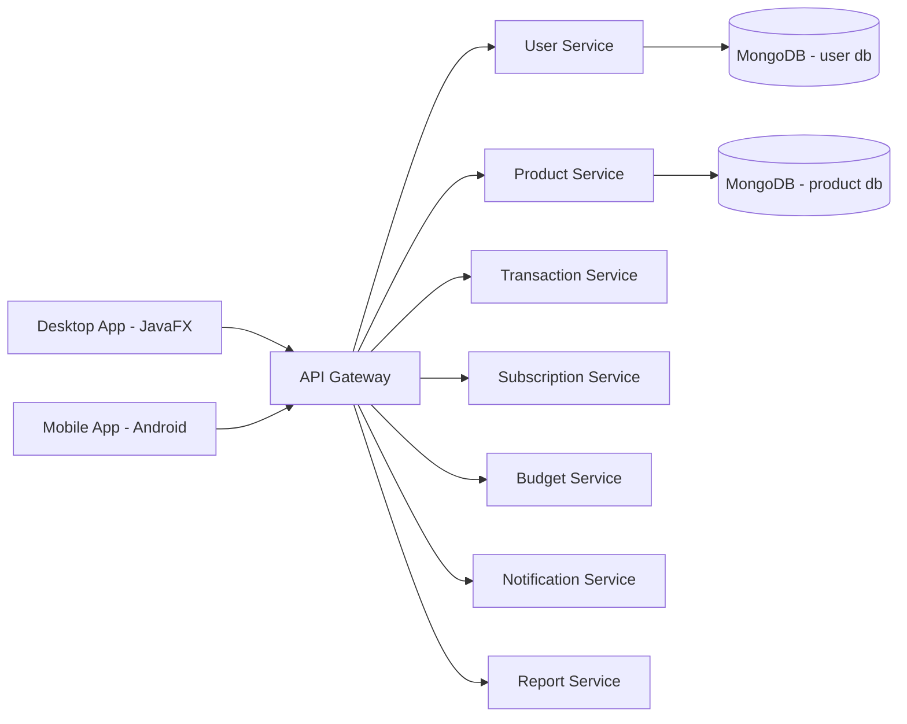

# Mimari Dokumani

## Genel Bakis

FinansCepte, mikroservis mimarisi ile gelistirilmistir. Her servis kendi sorumluluguna ve MongoDB verisine sahiptir.

## Bilesenler

- API Gateway (`api-gateway`)
- User Service (`service-user`)
- Product Service (`service-product`)
- Transaction Service (`transaction-service`)
- Subscription Service (`subscription-service`)
- Budget Service (`budget-service`)
- Notification Service (`notification-service`)
- Report Service (`report-service`)
- Ortak kutuphane (`common-lib`)
- JavaFX masaustu istemcisi
- Android mobil istemci

## Mermaid - Sistem Mimarisi

## Katmanli Yapi (Ornek: User Service)

- controller: REST endpointler
- service: is kurallari
- repository: data erisim katmani
- model: entity/DTO
- config: teknik konfig
- exception: hata yonetimi
- util: yardimci siniflar
