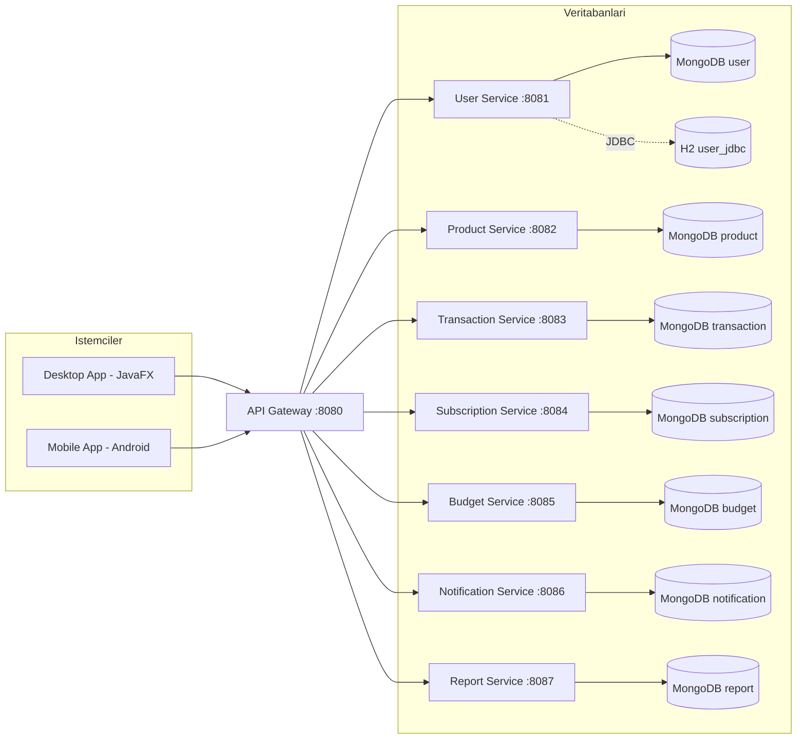

# Mimari Dokumani

## Genel Bakis

FinansCepte, mikroservis mimarisi ile gelistirilmistir. Her servis kendi sorumluluguna ve MongoDB verisine sahiptir.

## Bilesenler

| Servis | Port | Aciklama |
|--------|------|----------|
| API Gateway | 8080 | Spring Cloud Gateway - tum trafigi yonlendirir |
| User Service | 8081 | Kullanici yonetimi, JWT auth, JDBC+MongoDB dual repo |
| Product Service | 8082 | Urun yonetimi |
| Transaction Service | 8083 | Gelir/gider islem yonetimi |
| Subscription Service | 8084 | Abonelik yonetimi |
| Budget Service | 8085 | Butce limiti ve takibi |
| Notification Service | 8086 | Kullanici bildirimleri |
| Report Service | 8087 | Finansal rapor uretimi |
| Common Library | - | Generic repository, exception siniflari |
| JavaFX Desktop | - | Masaustu istemci (Dark Theme + Custom Canvas Charts) |
| Android Mobile | - | Mobil istemci |

## Mermaid - Sistem Mimarisi



## Katmanli Yapi (Tum Servisler)

```
com.finanscepte.xxx/
├── config/          # OpenAPI, teknik konfigurasyon
├── controller/      # REST endpointler
├── dto/             # Request/Response DTO'lar
│   ├── XxxRequest.java
│   └── XxxResponse.java
├── exception/       # Hata yonetimi
│   ├── GlobalExceptionHandler.java
│   └── ResourceNotFoundException.java
├── model/           # Entity/Domain modelleri
├── repository/      # Data erisim katmani
├── service/         # Is kurallari
│   ├── XxxService.java (interface)
│   └── impl/XxxServiceImpl.java
└── util/            # Mapper + yardimci siniflar
    └── XxxMapper.java
```

## Design Patterns Kullanimi

### 1. Strategy Pattern (Report Service)
Rapor uretiminde farkli formatlar/stratejiler:
- `MonthlySummaryStrategy`
- `CategoryBreakdownStrategy`

### 2. Template Method (Common-Lib GenericService)
CRUD operasyonlari icin sablon:
- `GenericService<T, ID>` arayuzu
- Tum servisler bu sablondan implementasyon saglar

### 3. Observer Pattern (Notification Service)
Olay tabanli bildirim sistemi

### 4. Repository Pattern
- `MongoRepository<T, String>` ve `JpaRepository<T, Long>`
- `GenericRepository<T>` ortak davranislar

### 5. Mapper Pattern
Entity <-> DTO donusumleri:
- `XxxMapper.toEntity(Request)`
- `XxxMapper.toResponse(Entity)`

### 6. Singleton Pattern
- `AuthManager` (Desktop app JWT token yonetimi)

## Hata Yonetimi

Tum servislerde standart hata yapiyi (`common-lib`'den) kullanir:

```json
{
  "timestamp": "2026-05-03T10:15:30",
  "status": 404,
  "error": "Not Found",
  "message": "User not found with id: 123",
  "path": "/api/users/123"
}
```

HTTP Status Kodlari:
- `201 CREATED` - Basarili olusturma
- `204 NO_CONTENT` - Basarili silme
- `400 BAD_REQUEST` - Validation hatasi
- `404 NOT_FOUND` - Kaynak bulunamadi
- `500 INTERNAL_SERVER_ERROR` - Beklenmeyen hata

## Docker Compose Altyapisi

```yaml
# Tum servisler:
# - Ortak bridge network (finanscepte-network)
# - MongoDB bagimliligi (condition: service_healthy)
# - Healthcheck endpoint'leri
# - cok-asamali build (parent POM + common-lib + servis)
```

## Givenlik

- JWT tabanli kimlik dogrulama (User Service)
- API Gateway uzerinde X-API-KEY kontrolu
- Password hashing (BCrypt)

## Teknoloji Stack

| Katman | Teknoloji |
|--------|-----------|
| Dil | Java 17 |
| Framework | Spring Boot 3.3.2 |
| Veritabani (NoSQL) | MongoDB 7.0 |
| Veritabani (SQL/JDBC) | H2 (runtime) |
| Gateway | Spring Cloud Gateway |
| Dokumantasyon | OpenAPI 3 / springdoc |
| Test | JUnit 5, Mockito, Testcontainers |
| Desktop | JavaFX 21 + Custom Canvas |
| Mobil | Android SDK + Retrofit |
| Container | Docker + Docker Compose |
| Load Test | k6 |

## Performans

- k6 ile 50 eszamanli kullanici test edildi
- p(95) hedefi: < 1000ms
- Hata orani hedefi: < %5
- Detayli rapor: `../performance-report.md`
